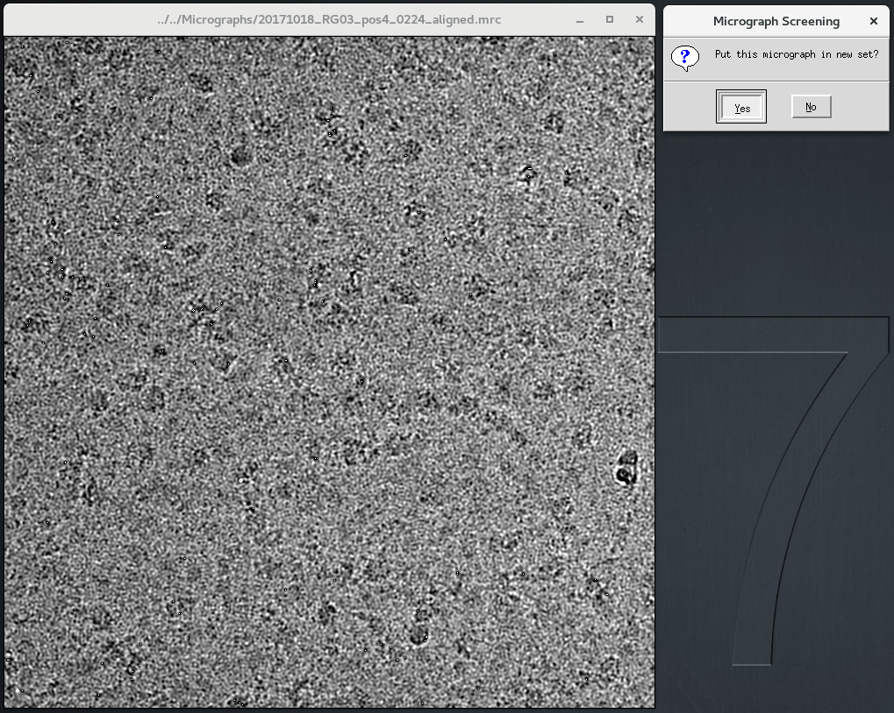

# OJcryo
###### A suite of Odd-Job scripts for cryo-em data processing.

## TOOLS AVAILABLE:

### RELION-specific:

- **OJcryo_relion_screen:** A simple interactive micrograph screening program that allows the removal of dirty/unwanted images from a cryo-EM image pool.

- **OJcryo_relion_rm_duplicates:** Removes any duplicate particles from a Relion join_particles.star file.

### Micrograph Drift Correction:

- **OJcryo_m2_tiff_batch:** Simple implementation of a TIFF batch mode for motioncor2 (requires GPU).

- **OJcryo_unblur_tiff:** Implements a TIFF batch and parallel-processing functionality for unblur; adjusts using gain reference, bins, and then unblurs (tif2mrc->clip->binvol->unblur).

## OVERVIEW:
OJcryo is a project I have been slowly adding to over the past two years as I have written helper scripts for my work in processing cryo-em data. I hope you find it useful as some of these have saved me LOTS of manual effort. Enjoy! -np

#### OJcryo_relion_screen:
DEPENDENCIES: RELION
1) Navigate to an Import/ folder in your RELION project that has a micrographs.star inside.
2) Run: OJcryo_relion_screen.py \<output_filename.star (optional)\>
3) One-by-one, each micrograph in this folder's micrographs.star will be displayed. Once you have made a decision on whether to keep it or not, click the window "X" (or press *Escape*).
4) A new window will pop up. To save the micrograph in your set, select "Yes" (or press *Enter*). Otherwise select "No" (or press *Escape*).

NOTE: OJcryo_relion_screen will run best when loading from a mounted drive, preferably an SSD. Screening over ssh will leave you pulling your hair out!

#### OJcryo_relion_rm_duplicates:
1) Navigate to a JoinStar/ folder that contains a join_particles.star or join_mics.star file.
2) RUN... 
   - (for particles): OJcryo_relion_rm_duplicates -p <starfile\>
   - (for micrographs): OJcryo_relion_rm_duplicates -m <starfile\>
3) Output: 
- (for particles): join_particles_no_duplicates.star
- (for micrographs): join_mics_no_duplicates.star

Included example:
Take a look at dupe_tester.star in the rm_duplicates folder. There are multiple entries for particle #314 (column 6).
Run: OJcryo_relion_rm_duplicates -p dupe_tester.star
Now look at the join_particles_no_duplicates.star -> NO DUPLICATES!

#### OJcryo_m2_tiff_batch:

#### OJcryo_unblur_tiff:
We capture images from the microscope as .tif files, but unfortunately Nike Grigorieff's [UNBLUR](http://grigoriefflab.janelia.org/unblur), only does batch micrograph correction for .mrc files. With this program, not only is a .tif batch mode implemented, but it also leverages subprocesses to align your movies up to 6x faster (!) (based on my prelim testing).

To run:
1) Navigate to the directory where all your TIFFs are.
2) Fill in the following command with your parameters: 
- OJcryo_unblur_tiff \<gainref\> \<cores\> \<ImgsPerStack\> \<A/pix\> \<DoseFilter?\> \<ExpsrPerFrm\> \<kV\> \<Pre-ExpsrAmount\> \<SaveAlignedFrames?\> \<ExpertOptions?\>
- AS A NOTE: In my testing, the speed gained by dedicating higher numbers to the \<cores\> argument greatly diminishes after 16. 8 cores appears to be the best bang for your buck, but if you have cores to burn go for it.

3) The aligned .mrc files will be written to a folder called "driftcorr_mrc\\"
